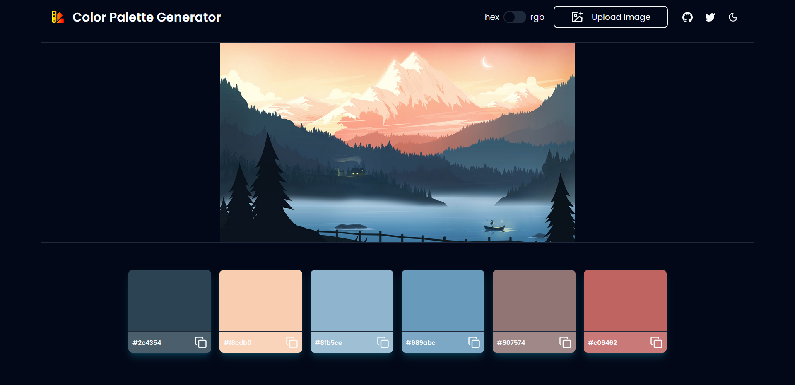

## Color Palette Generator

A Color Palette Generator (randomized / from an image) built with Next.js, TypeScript and Tailwind CSS (shadcn-ui).

Check it out here: [https://color-palette-gen.vercel.app/](https://color-palette-gen.vercel.app/)

### Features

-   Dark mode and Light mode
-   Copy the generated palette colors (toggle between hex and rgb value)
-   Upload an image to generate a palette, refresh the palette to get more options
-   Generate completely randomized colors in a palette and you might be lucky with some nice colors :D

### Technologies

### How to run

-   Clone this repository to your local system.
-   cd to the project directory on terminal and type `npm install` followed by `npm run dev`
-   Go to url: http://localhost:3000 in your browser to check out the app.

### Preview

  

### Support Development

  

